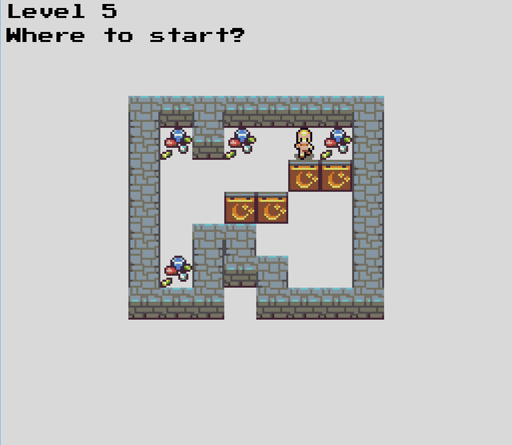

# Yet another Sokoban clone (YASC)

A lightweight and straightforward implementation of the classic Sokoban puzzle game.

<p align="center">

</p>

## Features
* Simple and clean Sokoban gameplay
* Keyboard and gamepad support (plug‑and‑play, no configuration required)
* 8 challenging levels plut custom level creation via the `assets/levels` file

## Build & Run

1. Build: Run `make` in the project root. Compiled binaries will be placed in the `build/` directory.

2. Run: Execute the binary in the root folder:
    ```bash
    ./build/release/game
    ```

## Requirements

* A GNU/Linux Distribution.
* The gcc C++ compiler.
* The SDL2 Library. On major distribution these can be installed via the package manager:
    * Debian based (Including Ubuntu): `sudo apt-get install libsdl2-2.0-0`
    * Arch based: `sudo pacman -S sdl2`

## Usage

* Press the arrow keys to move the character.
* Push the boxes on top of the diamond tiles. The level is complete all the diamonds are covered
* To add new levels edit the `assets/levels` file following the instructions in the header.

## Acknowledgments

* Tiles created by Lanea Zimmerman, licensed under the CC-BY 3.0 License.
* Font "PressStart2P" by Cody "CodeMan38" Boisclair, licensed under the SIL Open Font License.

